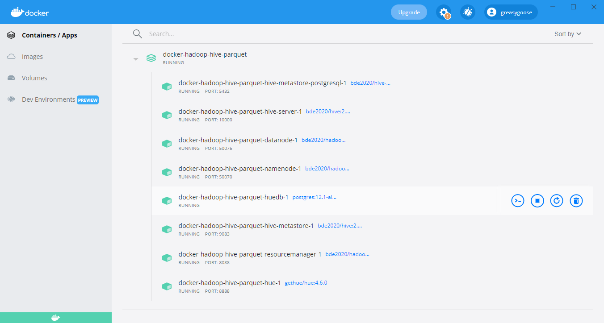
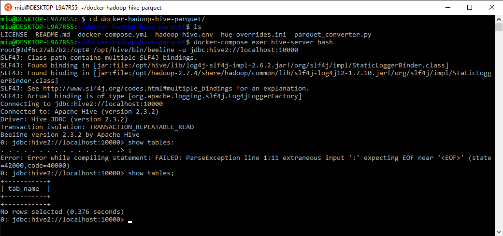
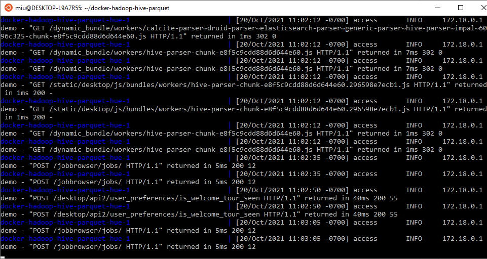
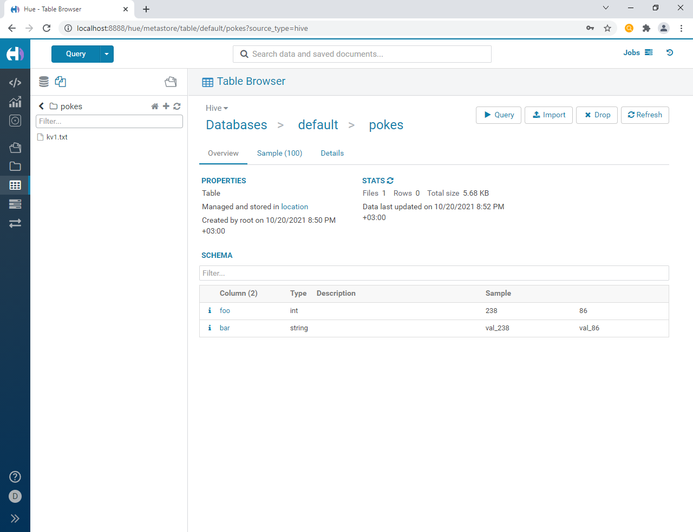
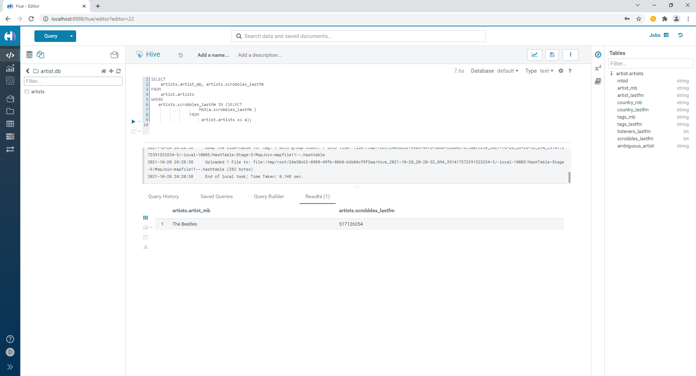
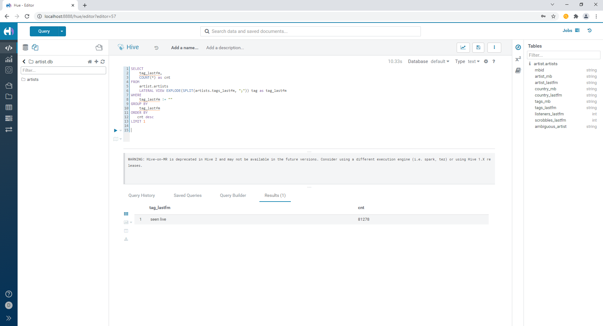

# HW02: Hive


## Блок 1. Развертывание локального Hive

1) Развернуть локальный Hive в любой конфигурации - 20 баллов
2) Подключиться к развернутому Hive с помощью любого инструмента: Hue, Python
Driver, Zeppelin, любая IDE итд (15 баллов за любой инструмент, максимум 30
баллов)
3) Сделать скриншоты поднятого Hive и подключений в выбранными вами
инструментах, добавить в репозиторий

-----------------------------------------
### 1) Hive

Hive-repository:

https://github.com/tech4242/docker-hadoop-hive-parquet


```
git clone https://github.com/tech4242/docker-hadoop-hive-parquet.git
cd docker-hadoop-hive-parquet
ls
nano docker-compose.yml
```

-> add port to resource manager
    ports:
      - 8088:8088

```docker-compose up```

-> wait util startup.


-> After startup, in new terminal window


```
cd docker-hadoop-hive-parquet
docker-compose exec hive-server bash
/opt/hive/bin/beeline -u jdbc:hive2://localhost:10000
```

```
show tables;
CREATE TABLE pokes (foo INT, bar STRING);
LOAD DATA LOCAL INPATH '/opt/hive/examples/files/kv1.txt' OVERWRITE INTO TABLE pokes;
select * from pokes limit 10;
```

```
Ctrl+c
exit
```
----------------------------------------------

### 2) Hue



(If 
hue ProgrammingError: relation "desktop_settings" does not exist
not loaded, restart in docker app [see screenshot1])

in browser got to

localhost:8888

create login, psw



## Блок 2. Работа с Hive

1) Сделать таблицу artists в Hive и вставить туда значения, используя датасет
https://www.kaggle.com/pieca111/music-artists-popularity - 15 баллов
2) Используя Hive найти (команды и результаты записать в файл и добавить в
репозиторий):
a) Исполнителя с максимальным числом скробблов - 5 баллов
b) Самый популярный тэг на ластфм - 10 баллов
c) Самые популярные исполнители 10 самых популярных тегов ластфм - 10
баллов
d) Любой другой инсайт на ваше усмотрение - 10 баллов


### 1) Create table

copy artists.csv
docker cp src_dir dst_dir


download artists csv to /mnt/x/ml_bd/archive
copy it to server

docker cp /mnt/x/ml_bd/archive/artists.csv docker-hadoop-hive-parquet-hive-server-1:/opt/
docker-compose exec hive-server bash
hdfs dfs -put artists.csv /user/
/opt/hive/bin/beeline -u jdbc:hive2://localhost:10000

CREATE TABLE artists (
mbid STRING,
artist_mb STRING,
artist_lastfm STRING,
country_mb STRING,
country_lastfm STRING,
tags_mb STRING,
tags_lastfm STRING,
listeners_lastfm INT,
scrobbles_lastfm INT,
ambiguous_artist STRING
)
ROW FORMAT DELIMITED
FIELDS TERMINATED BY ',';

LOAD DATA LOCAL INPATH "/user/artists.csv" INTO TABLE artists;

### 2) Singer with max scrobbles:

```
SELECT 
    artists.artist_mb, artists.scrobbles_lastfm 
FROM 
    artist.artists
WHERE
   artists.scrobbles_lastfm IN (SELECT 
                    MAX(a.scrobbles_lastfm ) 
                FROM 
                     artist.artists as a);
```



### 3)  Most popular lastfm_tag

```
SELECT
    tag_lastfm,
    COUNT(*) as cnt
FROM
    artist.artists 
    LATERAL VIEW EXPLODE(SPLIT(artists.tags_lastfm, ";")) tag as tag_lastfm
WHERE
    tag_lastfm != ""
GROUP BY
    tag_lastfm
ORDER BY
   cnt desc
LIMIT 1;
```
